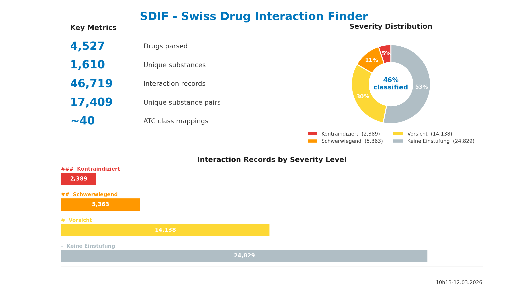

# SDIF - Swiss Drug Interaction Finder

A Rust tool that builds a searchable drug interactions SQLite database from the AmiKo Swiss drug database and EPha curated interaction data. It extracts interaction data from drug labels (Fachinformation) and enables basket-based interaction checking between drugs. Optionally includes EPha professionally graded ATC-pair interactions. Supports input by brand name or substance name.



## How it works

1. Downloads and reads the AmiKo full-text database (`amiko_db_full_idx_de.db`)
2. Downloads the official WHO ATC classification (`csv/atc.csv`) and EPha interactions (`csv/drug_interactions_csv_de.csv`) and cross-checks every drug's ATC code against the ATC classification
3. Extracts active substance names from ATC codes (German names), with fallback to the Zusammensetzung/Wirkstoffe HTML section when the ATC column lacks substance names
4. Parses the "Interaktionen" chapter plus interaction-relevant sentences from "Warnhinweise und Vorsichtsmassnahmen", "Kontraindikationen" and "Dosierung"
5. Uses Aho-Corasick multi-pattern matching to find substance mentions across all interaction texts
6. Scores severity of each interaction by scanning for German clinical keywords
7. Generates `interactions.db` with pre-computed interaction records

### Interaction detection strategies

- **Substance-level matching**: Direct lookup — does Drug A's interaction text mention Drug B's active substance?
- **ATC class-level matching**: Maps ATC code prefixes to German pharmacological class keywords (e.g. B01A → "Antikoagulantien", M01A → "Antiphlogistika") to catch class-level interactions like Ponstan (NSAID) ↔ Marcoumar (Vitamin-K-Antagonist). Keywords are maintained in [`txt/keywords.txt`](txt/keywords.txt) and stored in the `class_keywords` table during build for use by external apps.
- **CYP enzyme matching**: Detects CYP450-mediated interactions at query time — if Drug A's text mentions a CYP enzyme (e.g. CYP3A4) and Drug B is a known inhibitor or inducer of that enzyme, the interaction is flagged. Covers CYP3A4, CYP2D6, CYP2C9, CYP2C19, CYP1A2, CYP2C8, CYP2B6 with known inhibitors/inducers mapped by ATC prefix and substance name (e.g. Ritonavir ↔ Clobetasol via CYP3A4). Rules are stored in the `cyp_rules` table during build.
- **EPha curated interactions** (opt-in via `--epha`): 9,133 unique ATC-pair interactions from the EPha.ch database with professional 5-level risk grading (A = keine Massnahmen, B = Vorsichtsmassnahmen, C = Überwachung, D = Kombination vermeiden, X = Kontraindiziert). Includes structured effect descriptions, mechanisms, and recommended measures. Stored in a separate `epha_interactions` table — backward-compatible with existing tools

## Build & Run

```bash
cargo build --release

# Download source DB + ATC CSV + EPha CSV and build interactions database (first time)
sdif build --download

# Rebuild without downloading (subsequent runs)
sdif build

# Build and publish interactions.db to pillbox.oddb.org
sdif build --publish

# Check interactions between drugs (brand names or substance names)
sdif check Ponstan Marcoumar Aspirin
sdif check Phenprocoumon Navelbine

# Search interactions by clinical term
sdif search Prothrombinzeit
sdif search "QT-Verlängerung" -l 5
```

## CLI Usage

```
Swiss Drug Interaction Finder

Usage: sdif [COMMAND]

Commands:
  build              Build the interactions database (--download to fetch source DB, --publish to deploy)
  check              Check interactions between drugs in a basket
  search             Search interactions by clinical term
  class-interactions List all class-level interactions across all drug pairs
  serve              Start the web UI (default port 3000, --epha to include EPha interactions)
```

Running `sdif` without a subcommand defaults to `build`.

The `check` command accepts both brand names (Ponstan, Marcoumar) and substance names (Phenprocoumon, Mefenaminsäure). Substance names are resolved to their brand via the substance-brand map.

## Output

Generates `db/interactions.db` with the following tables:

- **drugs** — brand name, ATC code, ATC class, active substances, raw interaction text
- **interactions** — pre-computed substance-level interactions with context snippets, severity score and label
- **substance_brand_map** — maps substance names to brand names
- **epha_interactions** — EPha curated ATC-pair interactions with risk class, effect, mechanism, and measures
- **class_keywords** — ATC class keywords for class-level interaction detection (atc_prefix, keyword)
- **cyp_rules** — CYP450 inhibitor/inducer rules for enzyme-mediated interaction detection (enzyme, text_pattern, role, atc_prefix, substance)

### Stats

See the infographic at the top of this page — generated live from `db/interactions.db`.

```bash
# Regenerate stats image (requires matplotlib)
python3 generate_stats.py
```

After regenerating, update the filename reference in this README.

## Example: Ponstan + Marcoumar + Aspirin

```
$ sdif check Ponstan Marcoumar Aspirin

Basket contents:
  Ponstan® [M01AG01] -> mefenaminsäure
  Marcoumar® [B01AA04] -> phenprocoumon
  Aspirin® S [N02BA01] -> acetylsalicylsäure

INTERACTION [class-level]: Ponstan® <-> Marcoumar® (antikoagul) | Severity: # (Vorsicht)
  Mefenaminsäure verdrängt Warfarin aus dessen Proteinbindung,
  wodurch der gerinnungshemmende Effekt von Antikoagulantien
  vom Warfarin Typ verstärkt wird.

INTERACTION [substance match]: Ponstan® <-> Aspirin® S | Severity: - (Keine Einstufung)
  Via substance: acetylsalicylsäure
  Mefenaminsäure interferiert mit dem Thrombozytenaggregationseffekt
  von niedrig dosierter Acetylsalicylsäure (ASS)...

INTERACTION [class-level]: Aspirin® S <-> Ponstan® (entzündungshemm) | Severity: ### (Kontraindiziert)
  verstärkte Toxizität von Methotrexat...

INTERACTION [class-level]: Aspirin® S <-> Marcoumar® (antikoagul) | Severity: - (Keine Einstufung)
  Verstärkung der Wirkung von Antikoagulantien/Thrombolytika...

Severity levels: ### Kontraindiziert, ## Schwerwiegend, # Vorsicht, - Keine Einstufung
```

## Web UI

```bash
sdif serve           # starts on http://localhost:3000
sdif serve --epha    # include EPha curated interactions (with source badges)
sdif serve -p 8080   # custom port
```

Features:
- **Interaktions-Check**: Drug search with autocomplete (keyboard ↑/↓/Enter), auto-check on basket change, severity badge right after drug pair title, color-coded severity cards with explanations, FI quality hints for asymmetric severity between bidirectional pairs
- **Klinische Suche**: Full-text search with type-ahead suggestions including bigram phrases (e.g. type "hormonale" to see "hormonale Kontrazeptivum (76)"), preserves original capitalization, sorted by hit count
- **ATC-Klassen**: Overview of all 42 ATC class-level interaction mappings with sortable table
- **Shareable URLs**: Basket state encoded as ATC codes in URL (e.g. `?tab=check&drugs=M01AG01-B01AA04-N02BA01`)

### API Endpoints

- `GET /api/search-drugs?q=<term>` — Drug autocomplete (brand name or substance)
- `GET /api/search-drugs?atc=<code>` — Exact ATC code lookup
- `GET /api/suggest-terms?q=<partial>` — Clinical term type-ahead with hit counts
- `POST /api/check` — Basket interaction check (JSON body: `{"drugs": ["Ponstan", "Marcoumar"]}`)
- `GET /api/search-interactions?term=<term>&limit=<n>` — Clinical term search
- `GET /api/class-interactions` — ATC class-level interaction overview

## Example: Class-level interaction overview

```
$ sdif class-interactions

Scanning 4507 drugs for class-level interactions...
ATC Class  Drugs in Cl.   Drugs Mentioning    Potential Pairs   Top Keyword
------------------------------------------------------------------------------------------
L01                 328                202              66256   methotrexat
L04                 153                355              54315   ciclosporin
J01                 170                258              43860   antibiotik
B01A                 78                510              39780   warfarin
N06A                 98                375              36750   antidepressiv
N03                  65                540              35100   phenytoin
M01A                124                213              26412   nsar
...
------------------------------------------------------------------------------------------
Total potential class-level interaction pairs: 597280
```

## Example: Search by clinical term

```
$ sdif search "QT-Verlängerung" -l 3

Found 13 interactions matching "QT-Verlängerung" (showing top 3):

Clarithromycin Sandoz® <-> domperidon (Motilium®) | Severity: ### (Kontraindiziert)
  ...was zu QT-Verlängerung und Arrhythmien einschliesslich
  ventrikulärer Tachykardie, Kammerflimmern und Torsades de Pointes führen kann.
```
